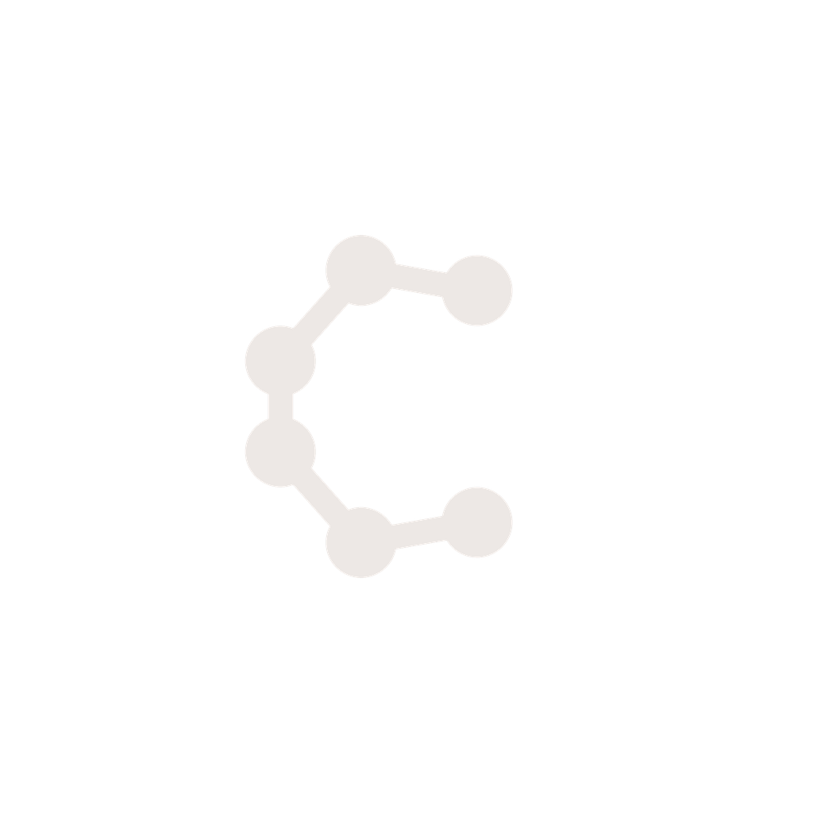

# Cadence

<p align="center">
  
</p>

<p align="center">
  <strong>A local desktop control room for AI coding sessions.</strong><br>
  Run Claude Code and OpenAI Codex side by side, track usage, browse session history,
  manage project context, and keep terminals, files, notes, and tasks in one focused workspace.
</p>

<p align="center">
  <a href="https://github.com/wookiesareppl2/cadence/releases"><strong>Download for Windows</strong></a>
  ·
  <a href="docs/DESIGN.md">Design system</a>
  ·
  <a href="#development">Development</a>
</p>

---

## What Cadence Is

Cadence is an Electron desktop app for developers who work with AI coding assistants every day.
It does not replace Claude Code or Codex. It wraps the command-line tools you already use in a
single project-first interface so your sessions, terminals, usage, files, and context stay visible.

The app is built for a dense, work-focused workflow: fewer windows, less terminal hunting, and a
clear view of what each assistant session is doing.

## Highlights

- **Claude Code and Codex in one app** - connect either tool or both. If only one is connected,
  Cadence hides the platform switcher and becomes a focused single-tool workspace.
- **Project-first session browsing** - browse by workspace/project first, then inspect sessions,
  titles, branches, age, transcript history, and active terminals.
- **Usage tracking you can trust** - parse local usage/session data, dedupe records, and show
  rolling plan windows so subscription limits are easier to monitor.
- **Integrated terminals** - run assistant terminals inside Cadence, detach them to another window,
  and jump back to terminals that are running in other sessions.
- **Files and live preview** - browse project files, open previews, follow source edits as they
  happen, and jump from terminal file references into the preview pane.
- **Memory and context views** - open project memory/context files in a dedicated surface instead
  of losing them in a generic file preview.
- **GitHub project import** - sign in with GitHub, clone repositories, and optionally restore
  encrypted project context from a private context vault.
- **Per-project notes and tasks** - keep lightweight planning notes and task lists attached to
  the project you are actively working in.

## Install

Cadence currently targets Windows 10/11.

1. Download the latest installer from the
   [Releases page](https://github.com/wookiesareppl2/cadence/releases).
2. Run the installer.
3. On first launch, connect Claude Code, Codex, or both.

The installer is not code-signed yet. Windows SmartScreen may show an "unknown publisher"
warning; use **More info -> Run anyway** if you trust this build.

## Privacy And Security

Cadence is local-first and does not include telemetry or analytics.

- Claude/Codex credentials stay on your machine and are read only when needed for local status or
  usage checks.
- GitHub OAuth tokens are handled in the main Electron process and stored with Electron
  `safeStorage` when available, with an in-memory fallback when OS encryption is unavailable.
- Project context vault snapshots are encrypted before they are written to GitHub.
- Private context and memory files are not meant to be committed to the public app repository.

## Repository Layout

```text
src/main/        Electron main-process services and IPC handlers
src/preload/     Sandboxed preload bridge
src/renderer/    React renderer app
src/shared/      Dependency-light shared types and pure helpers
tests/           Vitest coverage for shared and main-process logic
docs/            Design system and app conventions
scripts/         Build and release helpers
```

## Development

Cadence uses pnpm.

```bash
pnpm install
pnpm dev
pnpm typecheck
npx vitest run
npx electron-vite build
```

Useful notes:

- `pnpm dev` rebuilds native modules for Electron before starting the app.
- `pnpm test` rebuilds native modules for Node before running Vitest; stop the dev server first on
  Windows if native files are locked.
- Before UI work, read [`docs/DESIGN.md`](docs/DESIGN.md). It is the source of truth for tokens,
  panel behavior, buttons, icons, overlays, and interaction patterns.

## Release Builds

The updater installer is published as a GitHub Release on this
[repository](https://github.com/wookiesareppl2/cadence/releases).

```bash
pnpm release
```

The release script bumps the patch version, compiles the app, and publishes the Windows installer
with `electron-builder`. Installed apps pick up the new release on next launch.

## License

[MIT](LICENSE) © Sheldon Kumm
